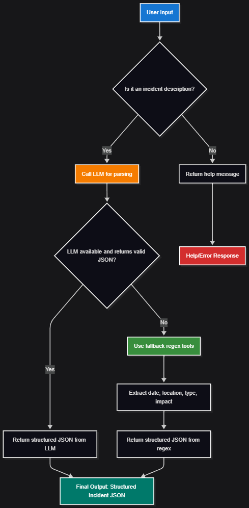

# Incident Parser Agent

A simple FastAPI-based service and CLI agent for parsing natural language incident descriptions into structured JSON, using LLMs (via Ollama) and regex fallback.

## 🏗️ Project Structure

```
.
├── .env
├── Dockerfile
├── entrypoint.sh
├── main.py
├── README.md
├── requirements.txt
├── run_agent.py
├── run_initial_tools.py
├── stark/
│   ├── __init__.py
│   ├── agent.py
│   └── instructions.py
├── tools/
│   └── incident_tools.py
└── workflow/
    ├── agent_workflow.mmd
    ├── agent_workflow.png
    ├── enhanced_agent_workflow.mmd
    └── enhanced_agent_workflow.png
```

- **main.py**: FastAPI server exposing the `/parse` endpoint and health checks.
- **run_agent.py**: CLI for interactive, batch, or single incident parsing.
- **run_initial_tools.py**: (Optional) Tool server setup for advanced scenarios.
- **stark/agent.py**: Core agent logic for parsing incidents.
- **tools/incident_tools.py**: LLM and regex-based incident parsing utilities.
- **stark/instructions.py**: Parsing instructions and helpers.
- **workflow/**: Mermaid diagrams for agent workflows.

## 🖼️ Agent Workflow




## 🚀 Getting Started

### Prerequisites

- Python 3.12+
- [Ollama](https://ollama.com/) running locally or accessible via network (default: `http://172.29.80.1:11434`)
- (Optional) Docker

---

#### 🧩 Check if Ollama is Installed and Running

1. **Check if Ollama is installed:**
   ```sh
   ollama --version
   ```
   If you see a version number, Ollama is installed. If you get an error, install it:

2. **Install Ollama:**
   - **Windows/Mac:** Download and install from [https://ollama.com/download](https://ollama.com/download)
   - **Linux:**  
     ```sh
     curl -fsSL https://ollama.com/install.sh | sh
     ```

3. **Start Ollama (if not running):**
   - On Windows/Mac, open the Ollama app.
   - On Linux, run:
     ```sh
     ollama serve
     ```

4. **Check if Ollama is running:**
   ```sh
   ollama list
   ```
   If you see a list of models or an empty list, Ollama is running.

5. **Install a model (e.g., llama3):**
   ```sh
   ollama pull llama3
   ```
   Replace `llama3` with your preferred model if needed.

---

### Installation

1. Clone the repository:
   ```sh
   git clone <your-repo-url>
   cd A3_AI_Engineer_case
   ```

2. Create and activate a virtual environment:
   ```sh
   python -m venv venv
   source venv/bin/activate  # On Windows: venv\Scripts\activate
   ```

3. Install dependencies:
   ```sh
   pip install -r requirements.txt
   ```

4. Configure your `.env` file (see sample in the repo).

### Running the API

Start the FastAPI server (requires Ollama running):

```sh
uvicorn main:app --host 0.0.0.0 --port 8080
```

Or use Docker:

```sh
sudo docker build --no-cache -t incident-parser:local .
docker run --rm -it --env-file .env -p 8080:8080 incident-parser:local
```

### Using the CLI Agent

Interactive mode:
```sh
python run_agent.py
```

Single incident parsing:
```sh
python run_agent.py --mode query --query "Ontem às 14h houve falha no servidor"
```

Batch processing:
```sh
python run_agent.py --mode batch --file incidents.txt
```

Test mode:
```sh
python run_agent.py --mode test
```

### API Endpoints

- `POST /parse` — Parse a single incident description.
- `POST /parse/batch` — Parse multiple incidents.
- `GET /health` — Health check (checks Ollama connectivity).
- `GET /models` — List available Ollama models.
- `GET /examples` — Example incident descriptions and expected outputs.

## 🛠️ Features

- Converts incident descriptions to structured JSON (`data_ocorrencia`, `local`, `tipo_incidente`, `impacto`)
- Uses LLM (via Ollama) for extraction, with regex fallback if LLM is unavailable
- REST API and CLI interface
- Docker support
- Mermaid diagrams for workflow visualization

## 📝 Example

**Input:**
```
Ontem às 14h, no escritório de São Paulo, houve uma falha no servidor principal que afetou o sistema de faturamento por 2 horas.
```

**Output:**
```json
{
  "data_ocorrencia": "2025-09-06 14:00",
  "local": "São Paulo",
  "tipo_incidente": "Falha no servidor principal",
  "impacto": "afetou o sistema de faturamento por 2 horas"
}
```

## 🤝 Contributing

1. Fork the repository
2. Create your feature branch (`git checkout -b feature/AmazingFeature`)
3. Commit your changes (`git commit -m 'Add some AmazingFeature'`)
4. Push to the branch (`git push origin feature/AmazingFeature`)
5. Open a Pull Request

---

**See also:**  
- [`stark/agent.py`](stark/agent.py) — core agent logic  
- [`tools/incident_tools.py`](tools/incident_tools.py) — parsing utilities  
- [`main.py`](main.py)


